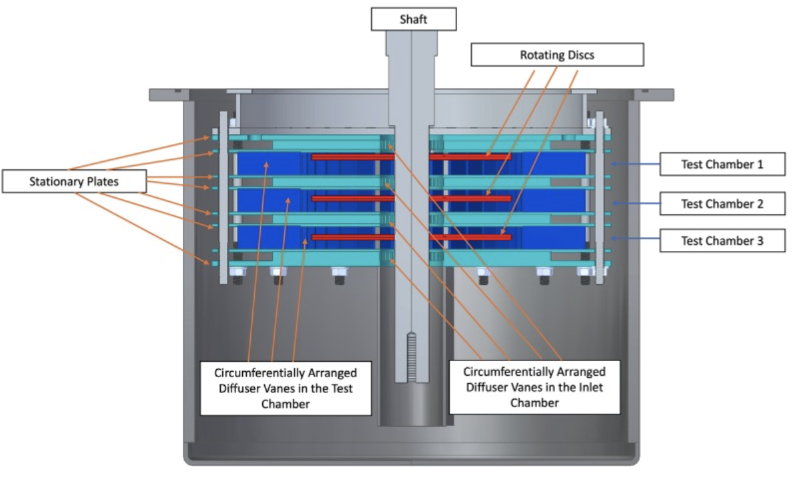

My first journal paper at KTH, titled ‘Hydrodynamic Design of the Separate Effect Test Facility for Flow-Accelerated Corrosion and Erosion (SEFACE) Studies in Liquid Lead,’ has been accepted in Nuclear Engineering and Design.

