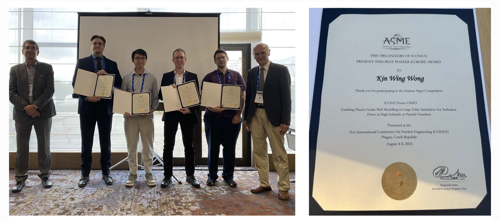

My conference poster on “Enabling Passive Scalar Wall Modelling in Large Eddy Simulation for Turbulent Flows at High Schmidt or Prandtl Numbers” got the Best Poster Award from ICONE-31. The paper, co-authored by Wong, I. Mickus, D. Grishchenko, and P. Kudinov (2024), addresses advanced modeling techniques for allow efficient simulations of turbulent flows in flow-accelerated corrosion prcoesses.

